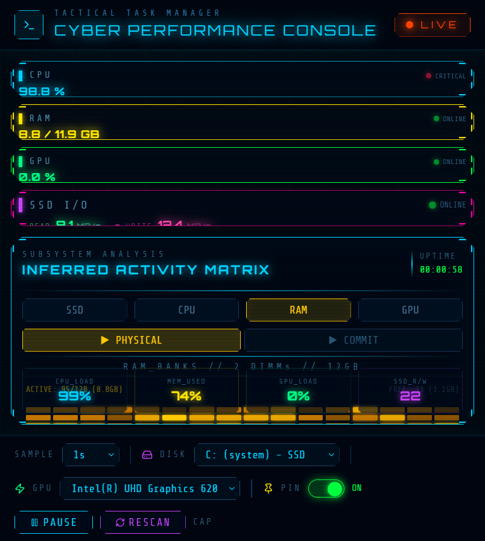

# Cyber Performance Console

A cyberpunk-themed real-time system monitoring dashboard built with React, Express, and Electron.

  



## Features

- **CPU Monitor** — Real-time load %, per-core utilization, clock speed, temperature
- **RAM Monitor** — Active/committed memory, pressure %, DIMM layout (slots, type, speed)
- **GPU Monitor** — Utilization %, VRAM usage, clock speed
- **SSD/HDD Monitor** — Read/write throughput via PowerShell performance counters
- **Activity Matrix** — 128-block grid visualization with 8 modes:
  - RAM: Physical (active memory) / Commit (including swap)
  - CPU: Per-Core (individual thread loads) / Aggregate (total)
  - GPU: Compute (utilization) / VRAM (memory usage)
  - Disk: R/W (read top, write bottom) / Throughput (combined)
- **Cyberpunk UI** — Matrix rain, scanlines, neon glow, Orbitron fonts
- **Desktop App** — Standalone Windows .exe via Electron

## Tech Stack

| Category | Package | Version |
|----------|---------|---------|
| **Frontend** | React | 18.3.1 |
| | Vite | 6.3.5 |
| | Tailwind CSS | 4.1.12 |
| | Recharts | 2.15.2 |
| | Lucide React | 0.487.0 |
| | Radix UI | Various |
| **Backend** | Express | 4.19.2 |
| | systeminformation | 5.23.5 |
| | cors | 2.8.5 |
| **Desktop** | Electron | 33.x |
| | electron-builder | 25.x |

## Project Structure

```
cyber-dashboard/
├── dashboard/              # Web app (dev + production)
│   ├── src/                # React source
│   │   └── app/
│   │       ├── App.tsx            # Main dashboard
│   │       └── components/
│   │           ├── MonitorCard.tsx    # CPU/RAM/GPU cards
│   │           ├── MemoryMatrix.tsx   # 128-block grid
│   │           ├── NeonLineChart.tsx  # Glow line charts
│   │           └── CyberPanel.tsx     # Styled panel wrapper
│   ├── server/
│   │   ├── index.mjs          # Express API server
│   │   └── disk-io.ps1        # PowerShell disk counters
│   ├── package.json
│   └── vite.config.ts
├── electron-app/           # Standalone desktop app
│   ├── main.cjs               # Electron + embedded Express
│   ├── preload.cjs            # Security context bridge
│   ├── package.json
│   └── server/
│       └── disk-io.ps1        # Bundled PowerShell script
└── .gitignore
```

## Installation

### Option 1: Web App (Development)

```bash
# Clone the repo
git clone https://github.com/cypherx007/cyber-dashboard.git
cd cyber-dashboard/dashboard

# Install dependencies
npm install

# Start dev server (API + frontend)
npm run dev
```

Open **http://localhost:5173** in your browser.

### Option 2: Web App (Production)

```bash
cd cyber-dashboard/dashboard

# Build frontend
npm run build

# Start production server
npm start
```

Open **http://localhost:8787** — Express serves the built frontend + API.

### Option 3: Desktop App (Electron .exe)

```bash
cd cyber-dashboard/electron-app

# Install dependencies
npm install

# Test locally
npm start

# Build Windows installer
npm run dist
```

The installer will be at `electron-app/dist/Cyber Dashboard Setup 1.0.0.exe`.

## Environment Variables

| Variable | Default | Description |
|----------|---------|-------------|
| `PORT` | `8787` | API server port |
| `VITE_API_URL` | `""` (same-origin) | Frontend API base URL |
| `ALLOWED_ORIGINS` | `localhost:5173,localhost:8787` | CORS allowed origins (comma-separated) |
| `NODE_ENV` | `development` | Set to `production` to serve built frontend |

See `dashboard/.env.example` for a template.

## System Requirements

- **OS**: Windows 10/11 (PowerShell required for disk I/O metrics)
- **Node.js**: 18+
- **RAM**: 512 MB minimum
- **Disk**: ~200 MB for Electron app, ~50 MB for web app

## API

Single endpoint: `GET /api/stats`

```json
{
  "cpu": { "load": 45.2, "speedMHz": 1800, "temp": null, "cores": 8, "physicalCores": 4, "brand": "Core™ i5-8250U", "perCore": [50, 40, 55, 30, 60, 35, 45, 50] },
  "memory": { "usedGB": 9.1, "totalGB": 11.9, "pressure": 76.5, "commitGB": 10.2 },
  "gpu": { "load": 15, "vramUsedMB": 512, "vramTotalMB": 1024, "clockMHz": 850, "model": "Intel(R) UHD Graphics 620" },
  "disk": { "readMBs": 25.3, "writeMBs": 4.1 },
  "memoryLayout": { "sticks": [{ "sizeGB": 4, "type": "DDR4", "clockSpeed": 2400, "bank": "BANK 0/0" }], "totalSlots": 4, "ready": true }
}
```

## Security

- CORS restricted to configured origins
- Rate limiting: 60 requests/minute per IP
- Error responses sanitized (no internal details)
- PowerShell script path validated before execution
- Context isolation enabled in Electron

## License

MIT
